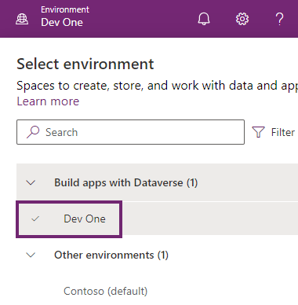

---
lab:
  title: "Labo\_0\_: Valider l’environnement de labo"
  module: 'Module 0: Course Introduction'
---

# Labo pratique 0 : Valider l’environnement de labo

> **IMPORTANT :** Ce labo vous fournit un locataire Microsoft 365 et des licences pour les applications Power Platform que vous utilisez dans ce cours. Un seul locataire vous est fourni pour les labos pratiques de ce cours. Les paramètres et les actions que vous effectuez dans ce locataire ne sont ni annulés ni réinitialisés, mais la machine virtuelle qui vous est fournie est réinitialisée chaque fois que vous fermez la session de labo. Notez que Microsoft 365 et Power Platform évoluent constamment. Les instructions de ce document peuvent ne pas correspondre exactement à l’expérience utilisateur dans votre locataire réel. Il est également possible de devoir patienter plusieurs minutes avant que la machine virtuelle dispose d’une connectivité réseau pour commencer les labos.

## Locataires WWL - Conditions d’utilisation

Si un locataire vous est fourni dans le cadre d’une formation dispensée par un instructeur, notez qu’il est mis à votre disposition dans le seul but de prendre en charge les labos pratiques de la formation.

Vous ne devez ni partager ni utiliser les locataires en dehors des labos pratiques. Le locataire utilisé dans ce cours est un locataire d’essai. Au terme de la classe, le locataire ne pourra pas faire l’objet d’une prolongation et vous ne pourrez plus l’utiliser ni y accéder.

Vous n’êtes pas autorisé à convertir un locataire en abonnement payant. Les locataires obtenus dans le cadre de ce cours sont la propriété de Microsoft Corporation. Nous nous réservons le droit d’y accéder et d’en reprendre possession à tout moment.

## Exercice 1 : Accéder à Microsoft Power Platform

Dans cet exercice, vous vérifiez que vous pouvez accéder à Power Apps.

### Tâche 1.1 : Se connecter à Power Apps

1. Vérifiez que vos **informations d’identification Microsoft 365** sont disponibles auprès de l’hébergeur de labo autorisé. Les informations d’identification se trouvent sous l’onglet **Ressources**.

1. Dans un nouvel onglet de navigateur, accédez à `https://powerapps.microsoft.com`

1. Cliquez sur **Connexion**.

1. Entrez l’`email address` fournie par l’hôte de labo autorisé.

1. Cliquez sur **Suivant**.

1. Entrez le `password` fourni par l’hôte de labo autorisé.

1. Cliquez sur **Connexion**.

1. Vous pouvez également sélectionner **Oui** pour rester connecté.

1. Si vous êtes invité à entrer des informations de contact, laissez le pays ou la région comme valeur par défaut, et entrez `0123456789` pour le numéro de téléphone, puis sélectionnez **Envoyer**.

1. En haut à droite de l’écran, vérifiez que l’**Environnement** est défini sur **Dev One**. C’est là que vous travaillez pendant toute la durée de ce labo. Si ce n’est pas le cas, sélectionnez l’environnement **Dev One**.

    

### Tâche 1.2 – Mettre à jour le navigateur

L’application des dernières mises à jour du navigateur empêche les problèmes dans le labo suivant lors de la création d’applications.

1. Ouvrez le navigateur **Microsoft Edge**.

1. Sélectionnez les **commandes (...)** en haut à droite du navigateur. Sélectionnez **Aide et commentaires**, puis sélectionnez **À propos de Microsoft Edge**.

1. Appliquez les mises à jour et redémarrez le navigateur si nécessaire.

## Exercice 2 – Microsoft Teams

Dans cet exercice, vous allez vérifier que vous pouvez accéder à une équipe dans Microsoft Teams.

### Tâche 2.1 : Se connecter à Microsoft Teams

1. Vérifiez que vos **informations d’identification Microsoft 365** sont disponibles auprès de l’hébergeur de labo autorisé. Les informations d’identification se trouvent sous l’onglet **Ressources**.

1. Dans un nouvel onglet de navigateur, accédez à `https://teams.microsoft.com`

1. Si vous êtes invité à connaître Teams, sélectionnez **Démarrer**, puis fermez la fenêtre contextuelle.

### Tâche 2.2 : Créer une équipe

1. Si aucune équipe n’est affichée, sélectionnez **Créer une équipe** dans le coin supérieur droit de la page.

1. Entrez `Contoso` dans le champ **Nom de l’équipe**.

1. Entrez `General` dans le champ **Nom du premier canal**.

1. Sélectionnez **Créer**.

1. Sélectionnez **Ignorer**.
