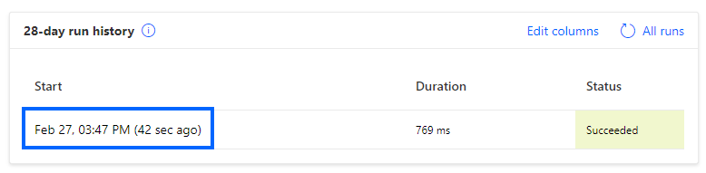
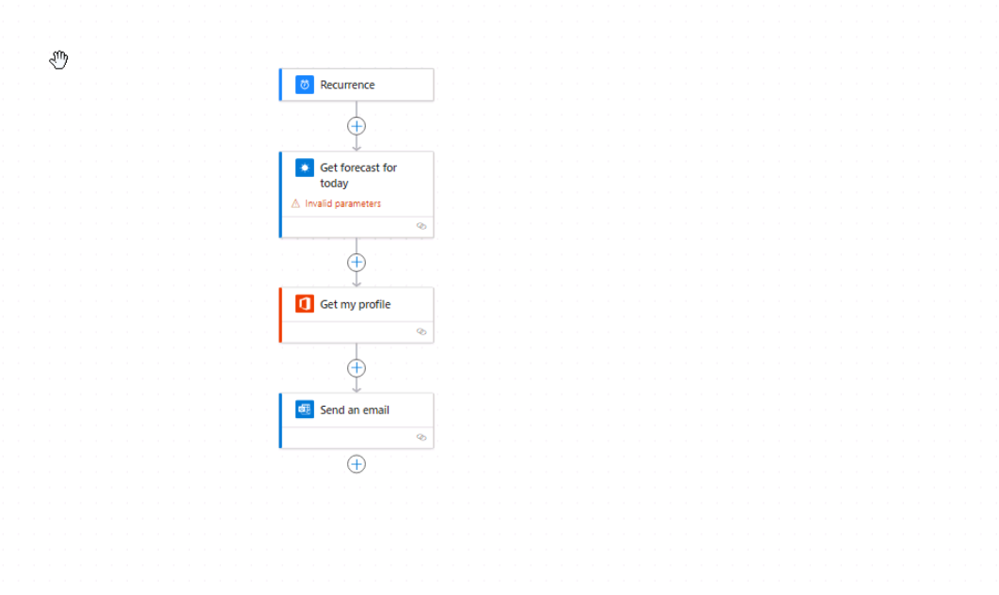
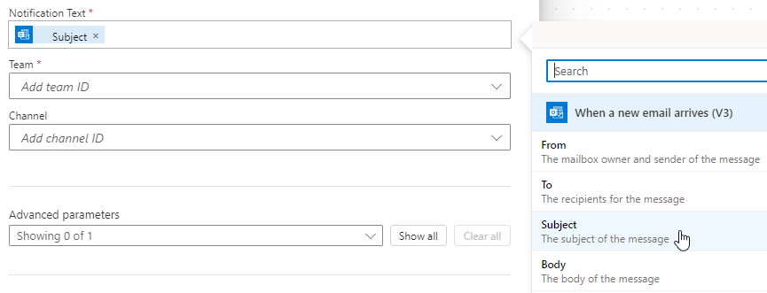

---
lab:
  title: "Labo\_1\_: Créer des flux de cloud"
  module: 'Module 1: Get started with Power Automate'
---

# Labo pratique 1 : Créer des flux de cloud

Dans ce labo, vous allez créer des flux de cloud.

## Contenu du didacticiel

- Comment créer des flux de cloud Power Automate à partir d’un modèle et avec Copilot
- Comment créer un flux de cloud Power Automate à partir de rien et ajouter des actions

## Étapes de labo de haut niveau

- Créer un flux de cloud à partir d’un modèle
- Créer un flux de cloud avec Copilot
- Créer un flux de cloud
- Surveiller l’activité de flux de cloud
  
## Prérequis

- Vous devez avoir effectué le **Labo 0 : Valider l’environnement de labo**

## Procédure détaillée

## Exercice 1 : Créer un flux de cloud à partir d’un modèle

### Tâche 1.1 : Sélectionner un modèle

1. Accédez au portail Power Automate `https://make.powerautomate.com`.

1. Si la boîte de dialogue contextuelle **Bienvenue dans Power Automate** s’affiche, sélectionnez **Démarrage**.

1. Sélectionnez l’environnement **Dev One**.

    

1. Sélectionnez l’onglet **Modèles** dans le menu de gauche.

1. Sélectionnez l’onglet **Bouton**.

1. Saisissez `location` dans le champ **Rechercher des modèles**.

    

1. Sélectionnez **Recevoir les prévisions météo du jour pour mon emplacement actuel**.

    

1. Sélectionnez **Créer** pour **MSN Weather**.

1. Sélectionnez **Créer** pour **Notifications**.

1. Sélectionnez **Créer un flux**.

1. Si la boîte de dialogue contextuelle **Votre flux est prêt à l’emploi** s’affiche, sélectionnez **Ne plus afficher**, puis **J’ai compris**.

    

### Tâche 1.2 : Exécuter le flux

1. Sélectionnez **Exécuter**.

1. Si vous y êtes invité, sélectionnez **Autoriser** pour **Connaître votre localisation**

1. Cliquez sur **Continuer**.

1. Cliquez sur **Exécuter le flux**.

1. Cliquez sur **Terminé**.

    

### Tâche 1.3 : Passer en revue le flux

1. Sélectionnez la date et l’heure dans l’historique d’exécution du flux.

    

1. Sélectionnez l’étape **Obtenir les prévisions du jour** avec la coche verte.

    

1. Sélectionnez **Modifier**.

1. Sélectionnez l’une des étapes **Envoyer une notification Push**.

1. Sélectionnez **Vérificateur de flux**. Il ne doit y avoir aucune erreur ou avertissement.

1. Fermez le volet **Vérificateur de flux**.

### Tâche 1.4 : Tester le flux

1. Sélectionnez **Tester**, **Automatiquement**, **Avec un déclencheur récemment utilisé**, puis sélectionnez l’exécution du flux.

    

1. Sélectionnez **Test**.

1. Sélectionnez le bouton Précédent **<-** en haut à gauche de la barre de commandes.

## Exercice 2 : Créer un flux de cloud avec Copilot

### Tâche 2.1 : Entrer une invite

1. Accédez au portail Power Automate `https://make.powerautomate.com`. 

1. Vérifiez que vous êtes dans l’environnement **Dev One**.

1. Sélectionnez l’onglet **Accueil** dans le menu de gauche.

1. Sous **Créer votre automatisation avec Copilot**, entrez `Every day send me an email with the daily summary from MSN Weather`

    

1. Sélectionnez **Générer**.

    

1. Cliquez sur **Suivant**.

1. Sélectionnez **Créer un flux**.

    

### Tâche 2.2 : Configurer l’étape de flux

1. Sélectionnez l’étape **Obtenir les prévisions du jour**.

1. Entrez `Seattle` comme **Localisation**.

1. Cliquez sur le **X** pour effacer les **Unités** et, dans la liste déroulante, sélectionnez **Impérial**.

    

1. Cliquez sur **Enregistrer**.

1. Pour tester votre flux, sélectionnez **Tester**, puis **Manuellement**, et cliquez sur **Tester**. 

1. Sélectionnez **Exécuter le flux**, puis **Terminé**.

1. Sélectionnez le bouton Précédent **<-** en haut à gauche de la barre de commandes.

## Exercice 3 : Créer un flux de cloud à partir de rien

### Tâche 3.1 : Créer le déclencheur

1. Accédez au portail Power Automate `https://make.powerautomate.com`.

1. Vérifiez que vous êtes dans l’environnement **Dev One**.

1. Sélectionnez l’onglet **+ Créer** dans le menu de gauche.

1. Sélectionnez **Flux de cloud automatisé**.

1. Entrez `Important email` pour **Nom du flux**.

1. Dans le champ **Rechercher parmi tous les déclencheurs**, saisissez `email arrives`.

1. Sélectionnez **À l’arrivée d’un nouvel e-mail (V3)**.

    

1. Sélectionnez **Créer**.

### Tâche 3.2 : Configurer le déclencheur

1. Sélectionnez le déclencheur **À la réception d’un e-mail (V3).**

1. Sélectionnez **Afficher tout**.

    

1. Pour **Inclure les pièces jointes**, sélectionnez **Non**.

1. Pour **Importance**, sélectionnez **Haute**.

1. Pour **Dossier**, sélectionnez **Boîte de réception**.

### Tâche 3.3 : Ajouter une action

1. Sélectionnez l’icône **+** sous l’étape du déclencheur, puis sélectionnez **Ajouter une action**.

1. Si vous y êtes invité, sélectionnez **Autoriser** pour **Afficher le texte et les images copiés dans le Presse-papiers**.

1. Entrez `notification` dans Rechercher.

    

1. Sélectionnez **Publier une notification de flux** sous **Microsoft Teams**.

1. Cliquez sur **Connexion**.

1. Utilisez vos informations d’identification de locataire.

1. Pour **Type de Notification**, sélectionnez **Team**.

1. Pour **Destinataire**, entrez l’ID d’utilisateur de votre locataire.

1. Saisissez `/` dans le champ **Texte de notification** et sélectionnez **Insérer du contenu dynamique**.

    

1. Sélectionner **Objet**.

1. Pour **Team**, sélectionnez **Contoso**.

1. Pour **Canal**, sélectionnez **Général**.

1. Sélectionnez **Enregistrer**.

1. Sélectionnez le bouton Précédent **<-** en haut à gauche de la barre de commandes.

## Exercice 4 : Surveiller des flux

### Tâche 4.1 : Activité de flux de cloud

1. Accédez au portail Power Automate `https://make.powerautomate.com`.

1. Vérifiez que vous êtes dans l’environnement **Dev One**.

1. Sélectionnez **... Plus** dans le menu de gauche.

    

1. Sélectionnez **Découvrir tout** et recherchez **Activité de flux de cloud** dans la section Surveiller.

1. Sélectionnez l’icône d’épingle pour **Activité de flux de cloud**.

1. Sélectionnez l’onglet **Activité de flux de cloud** dans le menu de gauche.

    

