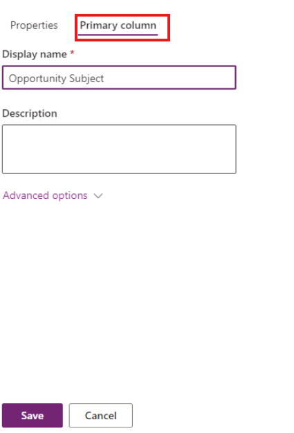

---
lab:
  title: "Labo\_2\_: Modèle de données"
  module: 'Module 2: Get started with Microsoft Dataverse'
---

# Labo pratique 2 : Modèle de données

Dans ce labo, vous allez créer des tables et des colonnes Dataverse.

## Contenu du didacticiel

- Comment créer des tables et des colonnes dans Microsoft Dataverse
- Comment créer une relation avec une colonne de recherche

## Étapes de labo de haut niveau

- Créer une table personnalisée
- Ajouter des colonnes à la table
- Créer une relation en utilisant une colonne de recherche
  
## Prérequis

- Vous devez avoir effectué le **Labo 0 : Valider l’environnement de labo**

## Procédure détaillée

## Exercice 1 : Créer des tables personnalisées

### Tâche 1.1 : Créer la table des opportunités

1. Accédez au portail de création Power Apps `https://make.powerapps.com`

1. Vérifiez que vous êtes dans l’environnement **Dev One**.

1. Dans le volet de navigation de gauche, sélectionnez **Tables**.

1. Sélectionnez **+ Nouvelle table**, puis **Table (propriétés avancées)**.

    

1. Entrez `Opportunity` comme **Nom d’affichage**.

### Tâche 1.2 : Colonne principale

1. Sélectionnez l’onglet **Colonne principale** en regard de l’onglet **Propriétés**.

    

1. Entrez `Opportunity Subject` comme **Nom d’affichage**.

1. Cliquez sur **Enregistrer**.

### Tâche 1.3 : Ajouter des colonnes

1. Dans le volet **Colonnes et données des opportunités**, sélectionnez **+** pour ajouter une nouvelle colonne.

    

1. Dans le volet **Nouvelle colonne**, entrez ou sélectionnez les valeurs suivantes :

   1. Nom d’affichage : `Owner Name`
   1. Type de données : **Ligne de texte unique**
   1. Obligatoire : **Contrainte obligatoire**

    

1. Sélectionnez **Enregistrer**.

1. Dans le volet **Colonnes et données des opportunités**, sélectionnez **+** pour ajouter une nouvelle colonne.

1. Dans le volet **Nouvelle colonne**, entrez ou sélectionnez les valeurs suivantes :

   1. Nom d’affichage : `Customer`
   1. Type de données : **Ligne de texte unique**
   1. Obligatoire : **Contrainte obligatoire**

1. Cliquez sur **Enregistrer**.

1. Dans le volet **Colonnes et données des opportunités**, sélectionnez **+** pour ajouter une nouvelle colonne.

1. Dans le volet **Nouvelle colonne**, entrez ou sélectionnez les valeurs suivantes :

   1. Nom d’affichage : `Address`
   1. Type de données : **Ligne de texte unique**
   1. Obligatoire : **Facultatif**

1. Développez **Options avancées** et saisissez `200` pour le **Nombre maximum de caractères**.

1. Cliquez sur **Enregistrer**.

1. Dans le volet **Colonnes et données des opportunités**, sélectionnez **+** puis, dans le volet **Nouvelle colonne**, entrez ou sélectionnez les valeurs suivantes :

   1. Nom d’affichage : `Estimated Close Date`
   1. Type de données : **Date et heure**
   1. Format: **Date uniquement**
   1. Obligatoire : **Facultatif**

1. Sélectionnez **Enregistrer**.

1. Dans le volet **Colonnes et données des opportunités**, sélectionnez **+** puis, dans le volet **Nouvelle colonne**, entrez ou sélectionnez les valeurs suivantes :

   1. Nom d’affichage : `Amount`
   1. Type de données : **Devise**
   1. Obligatoire : **Facultatif**

1. Sélectionnez **Enregistrer**.

1. Dans le volet **Colonnes et données des opportunités**, sélectionnez **+** puis, dans le volet **Nouvelle colonne**, entrez ou sélectionnez les valeurs suivantes :

   1. Nom d’affichage : `Notes`
   1. Type de données : **Plusieurs lignes de texte**
   1. Format: **Texte**
   1. Obligatoire : **Facultatif**

1. Sélectionnez **Enregistrer**.

### Tâche 1.4 : Ajouter une colonne de choix

1. Dans le volet **Colonnes et données des opportunités**, sélectionnez **+** puis, dans le volet **Nouvelle colonne**, entrez ou sélectionnez les valeurs suivantes :

   1. Nom d’affichage : `Status`
   1. Type de données : **Choix** > **Choix**
   1. Obligatoire : **Facultatif**

1. Sélectionnez **Non** pour **Synchroniser avec le choix global ?**

1. Entrez `New` pour **Étiquette** et `1` pour **Valeur**.

1. Sélectionnez **+ Nouveau choix**, puis entrez `Open` pour **Étiquette** et `2` pour **Valeur**.

1. Sélectionnez **+ Nouveau choix**, puis entrez `Closed` pour **Étiquette** et `3` pour **Valeur**.

1. Sélectionnez **Nouveau** pour **Choix par défaut**.

    

1. Sélectionnez **Enregistrer**.

## Exercice 2 : Créer une relation

### Tâche 2.1 : Créer une colonne de recherche

1. Accédez au portail de création Power Apps `https://make.powerapps.com`

1. Vérifiez que vous êtes dans l’environnement **Dev One**.

1. Dans le volet de navigation de gauche, sélectionnez **Tables**.

1. Cliquez sur **Opportunité**.

1. Dans le volet **Colonnes et données des opportunités**, sélectionnez **+** puis, dans le volet **Nouvelle colonne**, entrez ou sélectionnez les valeurs suivantes :

   1. Nom d’affichage : `Account`
   1. Type de données : **Lookup**
   1. Obligatoire : **Facultatif**
   1. Table associée : **Compte**

    

1. Sélectionnez **Enregistrer**.

## Exercice 3 : Données

### Tâche 3.1 : Ajouter des enregistrements d’opportunité

1. Accédez au portail de création Power Apps `https://make.powerapps.com`

1. Vérifiez que vous êtes dans l’environnement **Dev One**.

1. Dans le volet de navigation de gauche, sélectionnez **Tables**.

1. Cliquez sur **Opportunité**.

1. Dans le volet **Colonnes et données des opportunités**, sélectionnez le caret déroulant en regard de **Modifier** et sélectionnez **Modifier dans un nouvel onglet**.

1. Sélectionnez **+ Nouvelle ligne** et entrez ou sélectionnez les valeurs suivantes :

   1. Objet de l’opportunité : `100 Widgets`
   1. Nom du propriétaire : `MOD Administrator`
   1. Client : `Adventure Works`
   1. Date de clôture estimée : **Choisir une date dans le mois précédent**
   1. Montant : `10,000`
   1. Status: **Clôturé**

1. Sélectionnez **Insérer une ligne ci-dessous**, puis entrez ou sélectionnez les valeurs suivantes :

   1. Objet de l’opportunité : `Key customer`
   1. Nom du propriétaire : `MOD Administrator`
   1. Client : `Fabrikam`
   1. Date de clôture estimée : **Choisir une date future dans le mois en cours**
   1. Status: **Nouveau**
   1. Montant : `50,000`

1. Sélectionnez **Insérer une ligne ci-dessous**, puis entrez ou sélectionnez les valeurs suivantes :

   1. Objet de l’opportunité : `New customer`
   1. Nom du propriétaire : `MOD Administrator`
   1. Client : `Coho Winery`
   1. Date de clôture estimée : **Choisir une date future dans le mois suivant**
   1. Montant : `25,000`
   1. Status: **Nouveau**

1. Sélectionnez **Insérer une ligne ci-dessous**, puis entrez ou sélectionnez les valeurs suivantes :

   1. Objet de l’opportunité : `Repeat customer`
   1. Nom du propriétaire : `MOD Administrator`
   1. Client : `Fourth Coffee`
   1. Date de clôture estimée : **Choisir une date future dans le mois suivant**
   1. Montant : `15,000`
   1. État : **Ouvrir**

    

1. Fermez l’onglet.
