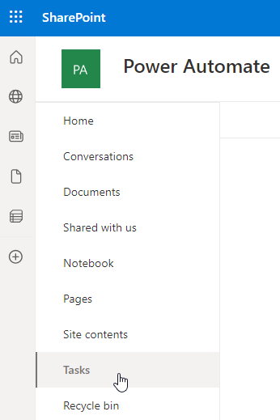

---
lab:
  title: "Labo 3\_: SharePoint"
  module: 'Module 3: Build approval flows with Power Automate'
---

# Practice Lab 3 – SharePoint

Dans ce labo, vous allez créer un site et une liste SharePoint.

## Contenu du didacticiel

- Comment créer une liste SharePoint
- Comment charger des données

## Étapes de labo de haut niveau

- Créer une liste SharePoint pour les opportunités
  
## Prérequis

- Vous devez avoir terminé **Lab 0 : Valider l’environnement lab **

## Procédure détaillée

## Exercice 1 – Créer une liste SharePoint

### Tâche 1.1 Créer un site SharePoint

1. Dans le portail [Power Apps Maker](https://make.powerapps.com) sélectionnez le **lanceur d’applications** en haut à gauche de la fenêtre du navigateur, puis sélectionnez **OneDrive**.

1. Dans SharePoint, sélectionnez **+Créer un site**.

1. Sélectionnez **site d’équipe**, sélectionnez modèle **d’équipe Standard**, puis **Utiliser le modèle**.

1. Entrez `Power Automate` pour le **nom de site**, puis sélectionnez **Suivant**.

1. Sélectionnez **Créer un site**.

1. Sélectionnez **Terminer**.

### Tâche 1.2 Créer une liste SharePoint

1. Dans le site SharePoint, sélectionnez **+ Nouveau**, puis **Liste**.

    

1. Sélectionnez **Liste vide**

1. Entrez `Tasks` pour le ** Nom**, puis sélectionnez **Créer**.

1. Sélectionnez **+ Ajouter une colonne**, sélectionnez **Plusieurs lignes de texte**, puis sélectionnez **Suivant**.

1. Dans le volet **Créer une colonne**, entrez ou sélectionnez les valeurs suivantes :

   1. Nom : `Description`
   1. Type de données : **Plusieurs lignes de texte**

1. Sélectionnez **Enregistrer**.

1. Sélectionnez **+Ajouter une colonne**, sélectionnez **Texte**, puis sélectionnez **Suivant**.

1. Dans le volet **Créer une colonne**, entrez ou sélectionnez les valeurs suivantes :

   1. Nom : `Owner Name`
   1. Type de données : **Ligne de texte unique**

1. Sélectionnez **Enregistrer**.

1. Sélectionnez **+ Ajouter une colonne**, sélectionnez **date et heure**, puis **Suivant**.

1. Dans le volet **Créer une colonne**, entrez ou sélectionnez les valeurs suivantes :

   1. Nom : `Deadline`
   1. Type de données : **Date et heure**

1. Sélectionnez **Enregistrer**.

1. Sélectionnez **+ Ajouter une colonne**, sélectionnez **Choix**, puis **Suivant**.

1. Dans le volet **Créer une colonne**, entrez ou sélectionnez les valeurs suivantes :

   1. Nom : `Approval Status`
   1. Type de données : **Choix**
   1. Choix 1 = `New`
   1. Choix 2 = `Approved`
   1. Choix 3 = `Declined`

1. Sélectionnez **Nouveau** pour **valeur par défaut**

    

1. Sélectionnez **Enregistrer**.

1. Copiez la première partie de l’URL du site SharePoint, par exemple `https://m365x99999999.sharepoint.com/sites/PowerAutomate/`

## Exercice 2 – Ajouter une liste SharePoint de données

### Tâche 2.1 - Ajouter des données

1. Accédez au site SharePoint et sélectionnez la liste **Tâches**.

    

1. Sélectionnez **+ Nouveau**, puis entrez les données suivantes, puis sélectionnez **Enregistrer** :

   1. Titre = `Contact Jon`
   1. Description = `Call or email`
   1. Nom du propriétaire = `MOD Administrator`
   1. Date limite = **Hier**
   1. État d’approbation = **Refusé**

1. Sélectionnez **+ Nouveau**, puis entrez les données suivantes, puis sélectionnez **Enregistrer** :

   1. Titre = `Create Quote`
   1. Description = `No discount`
   1. Nom du propriétaire = `MOD Administrator`
   1. Date limite = **Aujourd’hui**
   1. État d’approbation = **Approuvé**

1. Sélectionnez **+ Nouveau**, puis entrez les données suivantes, puis sélectionnez **Enregistrer** :

   1. Titre = `Visit Jim`
   1. Description = `First visit`
   1. Nom du propriétaire = `MOD Administrator`
   1. Date limite = **Demain**
   1. État d’approbation = **Nouveau**

    
