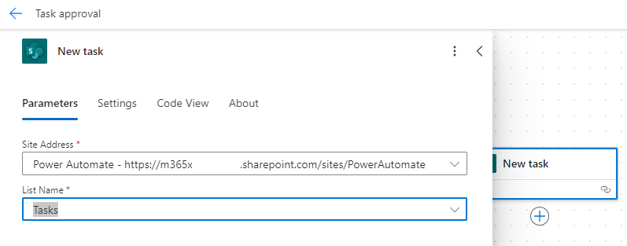

---
lab:
  title: "Labo\_4\_: Flux d'approbation"
  module: 'Module 3: Build approval flows with Power Automate'
---

# Labo de pratique 4 : Flux d’approbation

Dans ce labo, vous allez créer un flux d’approbation.

## Contenu du didacticiel

- Comment créer un flux cloud d’approbations Power Automate

## Étapes de labo de haut niveau

- Créer un flux cloud automatisé pour la liste SharePoint
- Créer une approbation
- Ajouter une condition pour le résultat de l’approbation
- Tester le flux
  
## Prérequis

- Vous devez avoir terminé **Labo 3 : SharePoint**

## Procédure détaillée

## Exercice 1 : Créer un flux d’approbation

### Tâche 1.1 : Créer le déclencheur

1. Accédez au portail Power Automate <https://make.powerautomate.com>.

1. Vérifiez que vous êtes dans l’environnement **Dev One**.

1. Sélectionnez l’onglet **+ Créer** dans le menu de gauche.

1. Sélectionnez **Flux de cloud automatisé**.

1. Entrez `Task approval` pour **Nom du flux**.

1. Entrer `SharePoint` dans Rechercher.

1. Sélectionner le déclencheur **Lorsqu'un élément est créé**.

1. Sélectionnez **Créer**.

### Tâche 1.2 : Configurer le déclencheur

1. Sélectionner l’étape **Lorsqu'un élément est créé**.

1. Sélectionner **Lorsqu'un élément est créé** et entrer `New task`.

1. Sélectionner le **site SharePoint Power Automate**.

1. Sélectionner la liste **Tâches**.

    

### Tâche 1.3 : Ajouter une action d’approbation

1. Sélectionnez l’icône **+** sous l’étape du déclencheur, puis sélectionnez **Ajouter une action**.

1. Entrer `approval` dans Rechercher.

    

1. Sélectionner **Démarrer et attendre une approbation** sous **Approbations**.

1. Sélectionnez **Créer**.

1. Sélectionner **Approuver/Rejeter : Premier à répondre** pour **type d’approbation**

1. Sélectionner **Démarrer et attendre une approbation*** puis entrer `Approval`.

1. Sélectionnez le champ **Notes**, puis l’icône Contenu dynamique.

    

1. Sélectionner **Titre**.

1. Pour **Affecté à**, entrez l’ID d’utilisateur de votre locataire.

1. Sélectionner le champ **Détails** puis l’icône Contenu dynamique.

1. Sélectionner **Description**.

1. Sélectionner le champ **Lien d’élément** et sélectionner l’icône de contenu dynamique, puis sélectionner **Afficher plus**.

1. Sélectionner **Lien vers l’élément**.

### Tâche 1.4 : Ajouter une condition

1. Sélectionner l’icône **+** sous l’étape de l’approbation, puis sélectionner **Ajouter une action**.

1. Entrer `condition` dans rechercher.

1. Sélectionner **Condition** sous **Contrôle**.

1. Sélectionnez **Enregistrer**.

1. Sélectionnez le bouton Back (Précédent) **<-** en haut à gauche de la barre de commandes.

1. Sélectionner le champ à gauche **Choisir une valeur**, puis sélectionner l’icône de contenu dynamique.

    

1. Sélectionner **Résultat**.

1. Sélectionner **est égale à** pour **Opérateur**.

1. Sélectionner le champ à droite **Choisir une valeur** et entrer `Approve`.

    

### Tâche 1.5 : Mettre à jour les actions de statut

1. Sélectionner l’icône **+** sous **Vrai** et sélectionner **Ajouter une action**.

1. Entrer `update item` dans rechercher.

1. Sélectionner **Mettre à jour l’élément** sous **SharePoint**.

1. Sélectionner **Mettre à jour l’élément** et entrer `Set task to approved`.

1. Sélectionner le **site SharePoint Power Automate**.

1. Sélectionner la liste **Tâches**.

1. Sélectionner le champ **ID**, puis l’icône de contenu dynamique.

1. Sélectionner **ID** dans **nouvelle tâche**.

1. Sélectionner **Afficher tout**.

1. Sélectionnez le champ **Notes**, puis l’icône Contenu dynamique.

1. Sélectionner **Titre** dans **Nouvelles tâches**.

1. Sélectionner **Approuvé** pour **Valeur d’état d’approbation**.

1. Sélectionner l’icône **+** sous **Faux** et sélectionner **Ajouter une action**.

1. Entrer `update item` dans rechercher.

1. Sélectionner **Mettre à jour l’élément** sous **SharePoint**.

1. Sélectionner **Mettre à jour l’élément 1** et entrer `Set task to declined`.

1. Sélectionner le **site SharePoint Power Automate**.

1. Sélectionner la liste **Tâches**.

1. Sélectionner le champ **ID**, puis l’icône de contenu dynamique.

1. Sélectionner **ID** dans **nouvelle tâche**.

1. Sélectionner **Afficher tout**.

1. Sélectionnez le champ **Notes**, puis l’icône Contenu dynamique.

1. Sélectionner **Titre** dans **Nouvelles tâches**.

1. Sélectionner **Refuser** pour **la valeur d’état d’approbation**.

1. Sélectionnez **Enregistrer**.

1. Sélectionnez le bouton Back (Précédent) **<-** en haut à gauche de la barre de commandes.

## Exercice 2 : Approbation des tests

### Tâche 2.1 : Déclencher le flux d’approbation

1. Naviguer vers le site SharePoint et sélectionner la liste **Tâches**.

1. Sélectionner **+ Nouveau**, puis entrer les données suivantes et sélectionner **Enregistrer** :

   1. Titre = `Approval test`
   1. Description = `Test`
   1. Nom du propriétaire = `MOD Administrator`
   1. Date limite = **Aujourd’hui**
   1. État d’approbation = **Nouveau**

### Tâche 2.2 : Approbation de progression

1. Accédez au portail Power Automate <https://make.powerautomate.com>.

1. Vérifiez que vous êtes dans l’environnement **Dev One**.

1. Sélectionner l’onglet **Mes flux** depuis le menu de gauche.

1. Sélectionner **Approbation de tâche**.

1. Sélectionner la date et l’heure dans l’historique d’exécution du flux.

    > ** Remarque : La fonctionnalité Approbations sera installée en arrière-plan. Cette opération va prendre environ 10 minutes.

1. Sélectionner l’onglet **Approbations** depuis le menu de gauche.

    

1. Sélectionner le **test d’approbation**, sélectionner le **Cycle** puis sélectionner **Confirmer**.

1. Cliquez sur **Terminé**.

1. Sélectionner l’onglet **Mes flux** depuis le menu de gauche.

1. Sélectionner **Approbation de tâche**.

1. Sélectionner la date et l’heure dans l’historique d’exécution du flux.

1. Naviguer vers le site SharePoint et sélectionner la liste **Tâches**.

1. Vérifier que le **Statut d’approbation** de l’élément de **Test d’approbation** est **Approuvé**.
