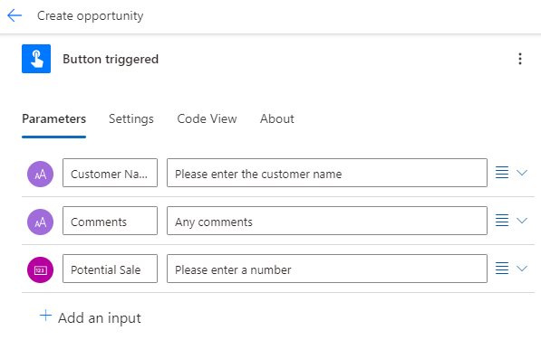
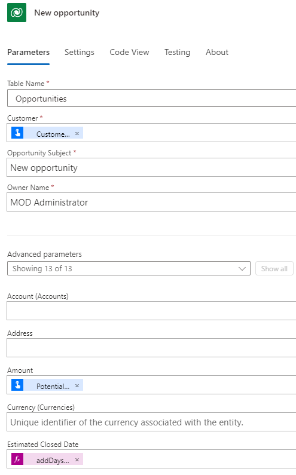

---
lab:
  title: "Labo\_5\_: Flux de bouton"
  module: 'Module 4: Build flows to manage user information'
---

# Labo pratique 5 – Flux de bouton

Dans ce labo, vous allez créer un flux de bouton.

## Contenu du didacticiel

- Comment créer un flux de bouton instantané Power Automate

## Étapes de labo de haut niveau

- Créer un flux de bouton
- Utiliser des jetons de déclencheur
- Ajouter une entrée utilisateur
- Tester le flux
  
## Prérequis

- Doit avoir complété le **Labo 2 : Modèle de données**

## Procédure détaillée

## Exercice 1 – Créer un flux de bouton

### Tâche 1.1 – Créer le déclencheur

1. Accédez au portail Power Automate `https://make.powerautomate.com`.

1. Vérifiez que vous êtes dans l’environnement **Dev One**.

1. Sélectionnez l’onglet **+ Créer** dans le menu de gauche.

1. Sélectionnez **Flux de cloud instantané**.

1. Entrez `Create opportunity` pour **Nom du flux**.

1. Sélectionnez **Déclencher manuellement un flux**.

1. Sélectionnez **Créer**.

### Tâche 1.2 – Ajouter une entrée utilisateur

1. Sélectionnez l’étape **Déclencher manuellement un flux**.

1. Sélectionnez le nom d’étape **Déclencher manuellement un flux** et saisissez `Button triggered`.

1. Sélectionnez **Ajouter une entrée**.

1. Sélectionnez **Texte**.

1. Entrez `Customer Name` dans **Entrée**.

1. Entrez `Please enter the customer name` dans **Tapez votre entrée**.

1. Sélectionnez **Ajouter une entrée**.

1. Sélectionnez **Texte**.

1. Entrez `Comments` dans **Entrée**.

1. Entrez `Any comments` dans **Tapez votre entrée**.

1. Sélectionnez **Ajouter une entrée**.

1. Sélectionnez **Nombre**.

1. Entrez `Potential Sale` dans **Nombre**.

    

### Tâche 1.3 – Ajouter une action de création d’opportunité

1. Sélectionnez l’icône **+** sous l’étape du déclencheur, puis sélectionnez **Ajouter une action**.

1. Entrer `add row` dans Rechercher.

1. Sélectionnez **Ajouter une nouvelle ligne** sous **Microsoft Dataverse**.

1. Sélectionnez **Se connecter**.

1. Utilisez les informations d’identification de votre locataire.

1. Sélectionnez le nom d’étape **Ajouter une nouvelle ligne** et entrez `New opportunity`.

1. Sélectionnez **Opportunités** pour le **Nom de la table**.

1. Saisissez `/` dans le champ **Client**, sélectionnez **Insérer du contenu dynamique**, puis cliquez sur **Voir plus**.

1. Sélectionnez **Customer Name** (Nom du client).

1. Sélectionnez le champ **Nom du propriétaire**, puis saisissez `MOD Administrator`.

1. Sélectionnez **Afficher tout**.

1. Sélectionnez le champ **Objet de l’opportunité**, puis saisissez `New opportunity`.

1. Saisissez `/` dans le champ **Quantité** et sélectionnez **Insérer du contenu dynamique**.

1. Sélectionnez **Potential Sale** (Vente potentielle).

1. Sélectionnez le champ **Notes** et sélectionner l’icône Contenu dynamique, puis **Voir plus**.

1. Sélectionnez **Comments** (Commentaires).

1. Saisissez `/` dans le champ **Date de clôture estimée**, puis sélectionnez **Insérer une expression**.

1. Entrez l’expression `addDays(utcNow(),30)`, puis sélectionnez **Ajouter**.

    

1. Sélectionnez **Enregistrer**.

## Exercice 2 – Tester le flux de bouton

### Tâche 2.1 – Exécuter le flux du bouton

1. Sélectionnez **Tester**.

1. Sélectionnez **Manuellement**.

1. Sélectionnez **Test**.

    

1. Entrez les informations suivantes :

   1. Customer Name=`Button test`
   1. Comments=`This is a test`
   1. Potential Sale=`9999`

1. Cliquez sur **Exécuter le flux**.

1. Cliquez sur **Terminé**.

1. Sélectionnez le bouton Back (Précédent) **<-** en haut à gauche de la barre de commandes.

### Tâche 2.2 – Vérifier l’enregistrement d’opportunité créé

1. Accédez au portail de création Power Apps `https://make.powerapps.com`

1. Vérifiez que vous êtes dans l’environnement **Dev One**.

1. Dans le volet de navigation de gauche, sélectionnez **Tables**.

1. Cliquez sur **Opportunité**.

