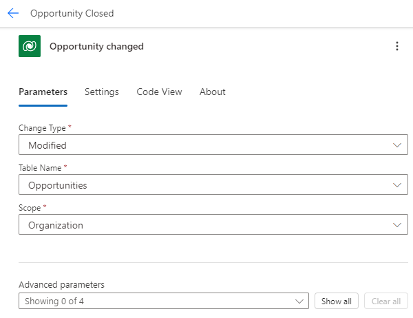

---
lab:
  title: "Labo\_7\_: filtres de déclencheur"
  module: 'Module 5: Power Automate’s deep integration across multiple data sources'
---

# Labo pratique 7 : Filtres de déclencheur

Dans ce labo, vous allez filtrer sur un déclencheur de mise à jour.

## Contenu du didacticiel

- Comment filtrer des déclencheurs

## Étapes de labo de haut niveau

- Créer un flux automatisé
- Ajouter un filtre de colonne
- Ajouter un filtre de requête

## Prérequis

- Doit avoir complété le **Labo 2 : Modèle de données**

## Procédure détaillée

## Exercice 1 : Nom du schéma

### Tâche 1.1 : Nom du schéma de colonne

1. Accédez au portail de création Power Apps `https://make.powerapps.com`

1. Vérifiez que vous êtes dans l’environnement **Dev One**.

1. Dans le volet de navigation de gauche, sélectionnez **Tables**.

1. Cliquez sur **Opportunité**.

1. En dessous de **Schéma**, sélectionner **Colonnes**.

1. Sélectionnez la colonne **État**.

    

1. Développez **Options avancées**.

    

1. Copiez le **Nom logique** à utiliser dans le flux.

   > **Remarque :** le préfixe de votre colonne Statut peut être différent.

## Exercice 2 : Créer un flux automatisé

### Tâche 2.1 : Créer le déclencheur

1. Accédez au portail Power Automate `https://make.powerautomate.com`.

1. Vérifiez que vous êtes dans l’environnement **Dev One**.

1. Sélectionnez l’onglet **+ Créer** dans le menu de navigation de gauche.

1. Sélectionnez **Flux de cloud automatisé**.

1. Entrez `Opportunity Closed` pour **Nom du flux**.

1. Entrez `Dataverse` dans la recherche de tous les déclencheurs.

1. Sélectionnez **Lorsqu’une ligne est ajoutée, modifiée ou supprimée**.

1. Sélectionnez **Créer**.

### Tâche 2.2 : Configurer le déclencheur

1. Sélectionnez l’étape **Lorsqu’une ligne est ajoutée, modifiée ou supprimée**.

1. Sélectionnez le nom d’étape **Quand une ligne est ajoutée, modifiée ou supprimée** et saisissez `Opportunity changed`.

1. Pour **Type de modification**, sélectionnez **Modifié**.

1. Sélectionnez **Opportunités** pour le **Nom de la table**.

1. Sélectionnez **Organisation** dans la liste **Étendue**.

    

### Tâche 2.3 : Envoyer un e-mail

1. Sélectionnez l’icône **+** sous l’étape du déclencheur, puis sélectionnez **Ajouter une action**.

1. Entrez `email` dans Rechercher.

1. Sous **Office 365 Outlook**, sélectionnez **Envoyer un e-mail (V2)**.

1. Sélectionnez le nom d’étape **Envoyer un e-mail (V2)** et saisissez `Notify by email`.

1. Sélectionnez le champ **À**, puis **Entrer une valeur personnalisée**.

1. Pour **À**, entrez l’ID d’utilisateur de votre locataire.

1. Sélectionnez le champ **Objet** et saisissez `Opportunity closed`.

1. Sélectionnez le champ **Corps**, puis l’icône de contenu dynamique.

1. Dans **Opportunité modifiée**, sélectionnez **Objet de l’opportunité**.

1. Sélectionnez le champ **Corps** et sélectionner l’icône Contenu dynamique, puis **Voir plus**.

1. Dans **Opportunité modifiée**, sélectionnez **État**.

### Tâche 2.4 : Filtre de colonne

1. Sélectionnez l’étape de déclencheur **Opportunity changed**.

1. Sélectionnez **Afficher tout**.

1. Sélectionnez le champ **Sélectionner des colonnes** et saisissez le **nom logique** de l’exercice précédent, par exemple : `cr977_status`.

   > **Remarque :** Le préfixe de votre colonne d’état sera différent.

### Tâche 2.5 : Filtre de ligne

1. Sélectionnez l’étape **Opportunité modifiée**.

1. Sélectionnez **Afficher tout**.

1. Sélectionnez le champ **Filtrer des lignes** et saisissez `cr977_status eq 3` à l’aide du **nom logique** de l’exercice précédent.

    

    > **Remarque :** Le préfixe de votre colonne d’état sera différent.

1. Sélectionnez **Enregistrer**.

1. Sélectionnez le bouton **<-****Précédent** en haut à gauche de la barre de commandes.

